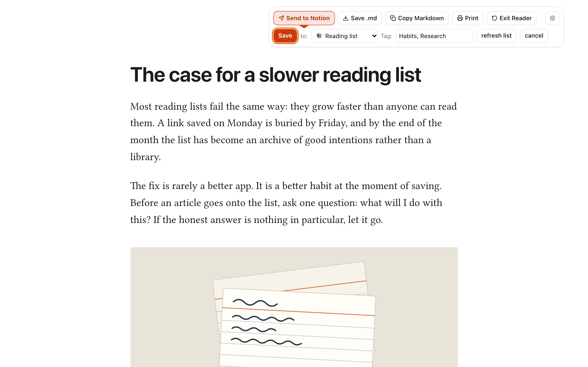
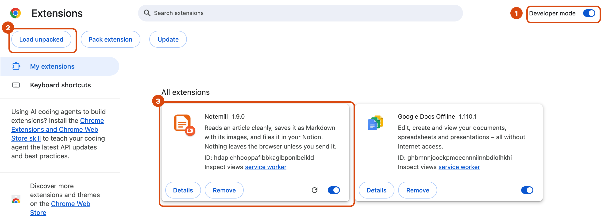
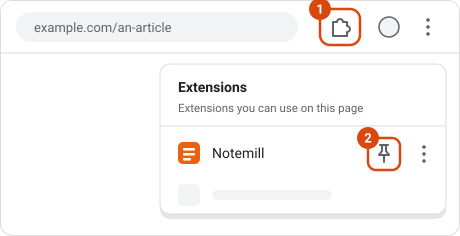
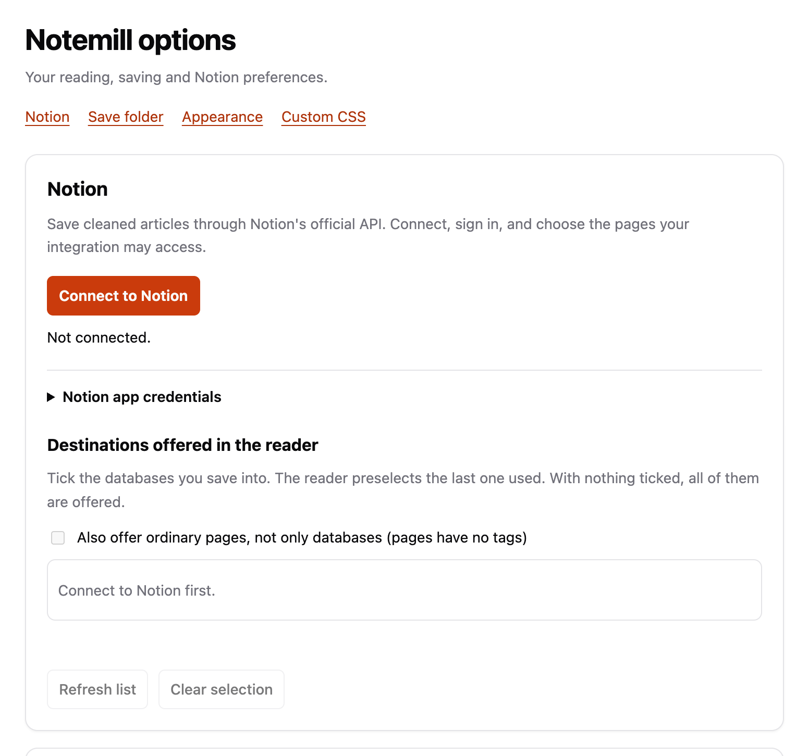
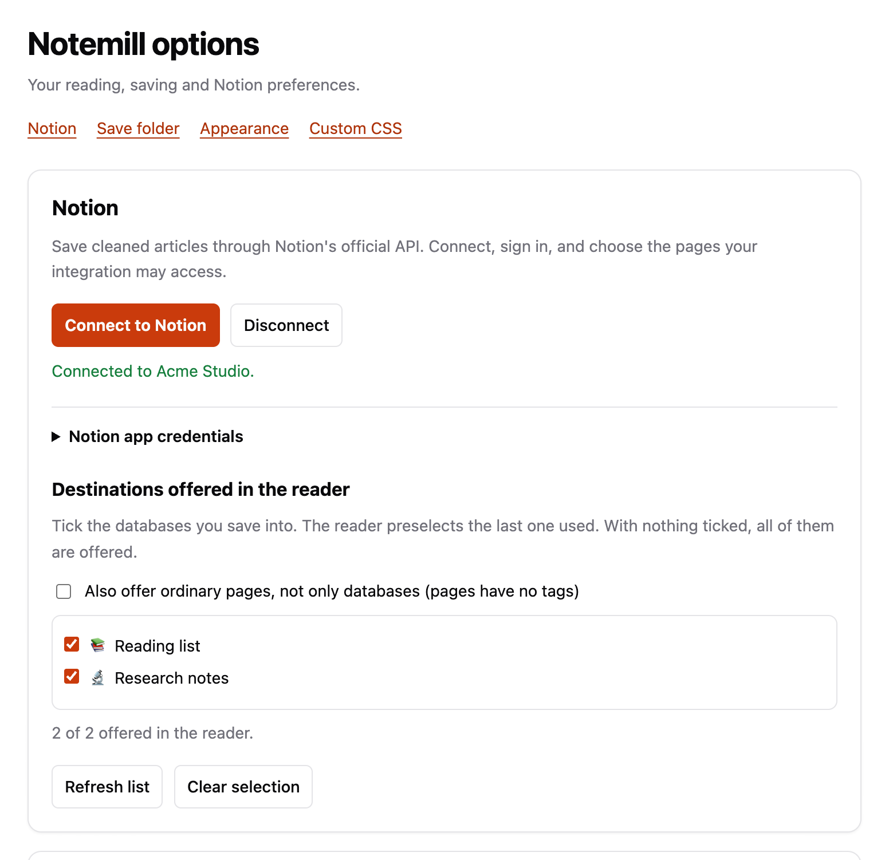
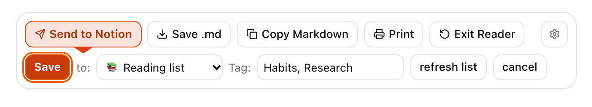
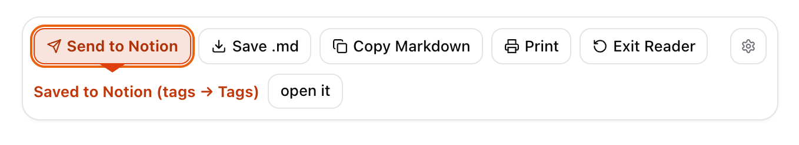
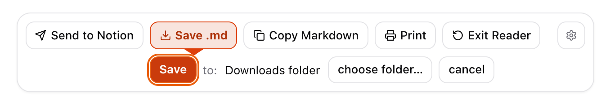

<p align="center">
  
</p>

<h1 align="center">Notemill</h1>

<p align="center">
  <b>Turn any web article into a clean page, and file it in Notion with one click.</b><br>
  Or save it as Markdown with its images. Free and open source.
</p>

<p align="center">
  <a href="https://github.com/versuchshaus/notemill/releases/latest/download/notemill.zip"><b>Download notemill.zip</b></a>
  &nbsp;·&nbsp;
  <a href="#install-in-3-minutes">Install guide</a>
  &nbsp;·&nbsp;
  <a href="#give-feedback">Give feedback</a>
</p>

<picture>
  <source media="(prefers-color-scheme: dark)" srcset="assets/readme/reader-notion-dark.png">
  
</picture>

> [!NOTE]
> **Early test version.** Notemill is being tried out by the Notion Ambassadors community.
> Your feedback decides what comes next. See [Give feedback](#give-feedback).

## Contents

- [What Notemill does](#what-notemill-does)
- [Install in 3 minutes](#install-in-3-minutes)
- [Connect Notion](#connect-notion)
- [Use it](#use-it)
- [Give feedback](#give-feedback)
- [Update, remove](#update-to-a-new-version)
- [Privacy](#privacy)
- [If something goes wrong](#if-something-goes-wrong)

## What Notemill does

- **Read without clutter.** One click turns a busy article into a calm page: no ads, menus,
  banners or pop-ups, just the text and its pictures in a comfortable column.
- **Send to Notion.** Choose one of your databases, add tags (Notemill suggests the ones the
  database already has), press Save. Notemill creates a new Notion page with the article's
  headings, text, images and a link to the source.
- **Save as Markdown.** A folder with the article as a `.md` file and its images, ready for
  Obsidian, iA Writer, Bear or any text editor.
- **Copy as Markdown** to paste anywhere, and **Print** (including *Save as PDF*).
- **Private by design.** The page is cleaned up on your own computer. Nothing is sent anywhere
  until you press *Send to Notion*, and then only to Notion. No tracking, no account.

## Install in 3 minutes

**Works in** Chrome and other Chromium browsers: Edge, Brave, Arc, Dia, Opera, Vivaldi.
**Not yet in** Firefox or Safari.

Notemill is not in the Chrome Web Store yet, so you install it by hand, once. This uses
Chrome's *Developer mode*, the normal way to install an extension from outside the store.

### 1. Download

Download **[notemill.zip](https://github.com/versuchshaus/notemill/releases/latest/download/notemill.zip)**.

> [!IMPORTANT]
> Use this download link, not the green **Code → Download ZIP** button on this page.
> That one is the source code, and Chrome cannot load it as it is.

### 2. Unzip, and keep the folder

Double-click `notemill.zip`. You get a folder called **`notemill`**.

Move that folder somewhere it can stay, for example into *Documents*. Chrome loads Notemill
from this folder every time it starts: if you delete or move it later, Notemill stops working.

> **On Windows**, *Extract All* puts the folder inside another folder of the same name.
> Remember the inner one, the folder that contains a file called `manifest.json`.

### 3. Open the extensions page

Type **`chrome://extensions`** into the address bar and press Enter.

In Edge, type `edge://extensions` instead. If your browser does not open the page, use its
menu: *Extensions → Manage extensions*.

### 4. Switch on Developer mode, then load the folder

<picture>
  <source media="(prefers-color-scheme: dark)" srcset="assets/readme/install-extensions-dark.png">
  
</picture>

1. Switch on **Developer mode** at the top right.
2. Click **Load unpacked**, select the **`notemill`** folder from step 2, and click *Select*.
3. Notemill appears in the list, and its settings open in a new tab. That is the next step.

### 5. Pin the button to the toolbar

<picture>
  <source media="(prefers-color-scheme: dark)" srcset="assets/readme/pin-dark.svg">
  
</picture>

Click the **puzzle-piece icon** in the toolbar, then the **pin** next to Notemill.
Notemill's orange icon now stays in the toolbar.

> Some browsers show a reminder about extensions in developer mode when they start. Close it
> or choose *Cancel*. Choosing *Disable* switches Notemill off; switch it back on at
> `chrome://extensions`.

## Connect Notion

Notemill's settings opened by themselves after installing. To get back to them later,
right-click the Notemill icon and choose **Options**, or click the gear in the reader.

<picture>
  <source media="(prefers-color-scheme: dark)" srcset="assets/readme/options-connect-dark.png">
  
</picture>

1. Click **Connect to Notion**.
2. The browser asks whether Notemill may access **api.notion.com**. Click **Allow**: that is
   Notion's own address, which Notemill needs to create pages for you.
3. Notion opens a sign-in window. Choose your workspace, then **select the pages and databases
   Notemill may use**. Include at least the database your articles should go into, for example
   a *Reading list*; selecting a page also shares the databases inside it. Notemill can only
   see what you select here.
4. Back in the settings you see *Connected to* your workspace and your databases. Optionally
   tick the ones the reader should offer; with nothing ticked, all of them are offered.

<picture>
  <source media="(prefers-color-scheme: dark)" srcset="assets/readme/options-connected-dark.png">
  
</picture>

**Databases, not pages.** Notemill offers your databases as destinations, because that is
where a saved article gets properties and tags. To save into ordinary pages as well, tick
*Also offer ordinary pages* in the settings.

**Tags.** Notemill writes tags into a database's *Tags* column: a multi-select column, or a
relation to a tags database.

Notion is optional: reading, Markdown, copying and printing work without connecting.

## Use it

1. Open any article: a blog post, a news story, a Medium or Substack post.
2. Click the **Notemill icon**, or press **⌘⇧U** on a Mac, **Ctrl+Shift+U** on Windows and Linux.
3. The page turns into a clean reading view. The toolbar stays at the top right while you scroll.

### Send to Notion

Press **Send to Notion**. A row opens directly under the button: **Save · to:** your
destination · **Tag:** your tags. The last destination you used is already selected.

<picture>
  <source media="(prefers-color-scheme: dark)" srcset="assets/readme/notion-row-dark.png">
  
</picture>

Press **Save**. A moment later the row says *Saved to Notion*, with a link to the new page.

<picture>
  <source media="(prefers-color-scheme: dark)" srcset="assets/readme/notion-saved-dark.png">
  
</picture>

Each press of Save creates a **new** Notion page, so press it once per article.

### Save as Markdown

Press **Save .md**. The row shows where the article goes: your *Downloads* folder, or a folder
you choose once with *choose folder…*. Press **Save**.

<picture>
  <source media="(prefers-color-scheme: dark)" srcset="assets/readme/markdown-row-dark.png">
  
</picture>

You get one folder per article:

```text
the-case-for-a-slower-reading-list/
  the-case-for-a-slower-reading-list.md
  images/
    01-cards.svg
```

A `.md` file is plain text with a few marks for headings and links. Keep the folder together:
the text finds its pictures in `images/`.

### The other buttons

| Button | What it does |
| --- | --- |
| **Copy Markdown** | Copies the article as Markdown. Paste it into any notes app. Images stay as links. |
| **Print** | Opens the print dialog. Choose *Save as PDF* there for a PDF. |
| **Exit Reader** | Goes back to the original page. |
| **Gear** | Opens Notemill's settings: Notion, save folder, light or dark theme. |

**Keyboard.** The reader opens with *Send to Notion* selected, so **Enter, Enter** files the
article to your usual destination. **Esc** closes the row; **Esc** again leaves the reader.

## Give feedback

This test exists to hear from you. Two minutes help a lot.

- **[Share feedback](https://github.com/versuchshaus/notemill/issues/new?template=feedback.yml)**:
  what worked, what confused you, what you would change.
- **[Report a problem](https://github.com/versuchshaus/notemill/issues/new?template=bug_report.yml)**:
  something broke or looked wrong.
- **[Ideas and questions](https://github.com/versuchshaus/notemill/discussions)**: talk with the
  maker and other testers.

Please mention your browser and Notemill's version, which `chrome://extensions` shows next to
the name.

## Update to a new version

1. Download the new [notemill.zip](https://github.com/versuchshaus/notemill/releases/latest/download/notemill.zip) and unzip it.
2. Replace your `notemill` folder with the new one, in the same place.
3. On `chrome://extensions`, click the circular arrow on the Notemill card.

Your Notion connection and settings stay as they are.

## Remove Notemill

On `chrome://extensions`, click **Remove** on the Notemill card, then delete the folder.
To revoke Notion access as well: in Notion, open *Settings → Connections* and disconnect
Notemill.

## Privacy

- The reading view is built **on your computer**. No server ever sees the page.
- **Send to Notion** sends the article from your browser straight to Notion's API.
- **Signing in to Notion** passes Notion's one-time sign-in code through a small Notemill
  service that adds the app's secret and returns your access token. It stores nothing and
  logs nothing; its whole source is in [`server/`](server/).
- **Save .md** writes only to your computer. Pictures are downloaded from the site you are
  reading.
- No analytics, no tracking, no account.

Details, including every permission and what is stored where: [PRIVACY.md](PRIVACY.md).

## If something goes wrong

| What you see | What to do |
| --- | --- |
| *Manifest file is missing or unreadable* | You selected the wrong folder, or downloaded the source code. Select the `notemill` folder from `notemill.zip`: the one containing `manifest.json`. |
| Clicking the icon does nothing | Notemill only works on ordinary web pages, not on `chrome://` pages, the Web Store, PDFs or a new tab. Open an article and try again. A tab that was open before you installed may need a reload. |
| The shortcut does nothing | Another extension may use it. Set your own at `chrome://extensions/shortcuts`. |
| *Connect to Notion* fails or the window closes | Click Connect again and finish the Notion window without closing it. Make sure you installed from `notemill.zip`. |
| A database is missing in the reader | Notemill only sees what you selected when connecting. In Notion, open the database, choose **•••** → *Connections* → *Notemill*. Then press *Refresh list* in the settings. Notion can take a minute before a newly shared database appears. |
| Tags are not saved | The database needs a *Tags* column: multi-select, or a relation to a tags database. |
| Some pictures are missing | Some sites block downloads of their images. The text is saved; the result says how many pictures could not be read. |
| Notemill disappeared after a restart | The `notemill` folder was moved or deleted, or the developer-mode reminder was answered with *Disable*. Re-enable it at `chrome://extensions`. |

Still stuck? [Report a problem](https://github.com/versuchshaus/notemill/issues/new?template=bug_report.yml).

## For developers

Building from source, running the tests, deploying the sign-in service and making a release:
[DEVELOPMENT.md](DEVELOPMENT.md).

## Credits and licence

Notemill is made by Stephan von Lingelsheim and released under the **MIT licence**
([`LICENCE`](LICENCE)). The article parser is Arc90's Readability (Apache 2.0,
[`LICENCE-APACHE`](LICENCE-APACHE)); the reading font is Linux Libertine (SIL Open Font Licence,
[`FONT-LICENCE.txt`](FONT-LICENCE.txt)).

Notion is a trademark of Notion Labs, Inc. Notemill is an independent project, not affiliated
with or endorsed by Notion Labs.
